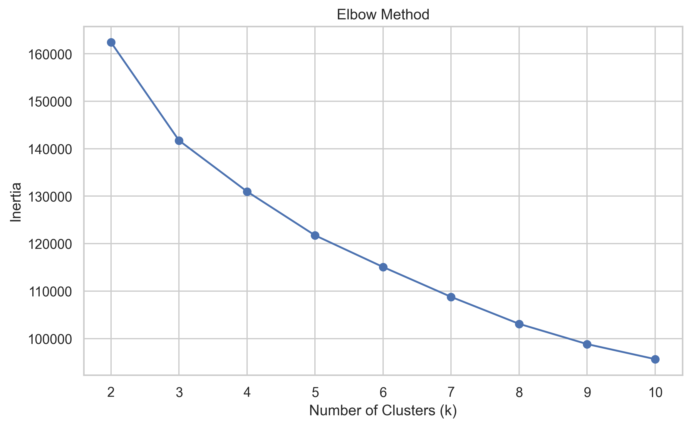
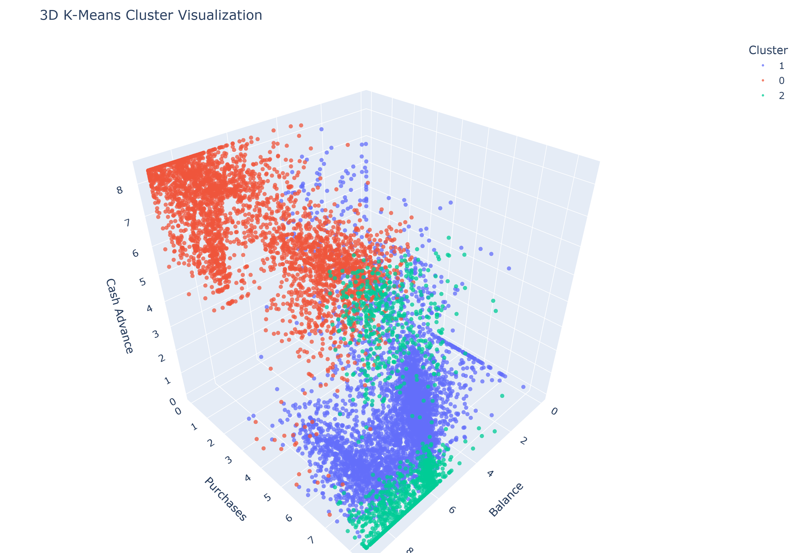
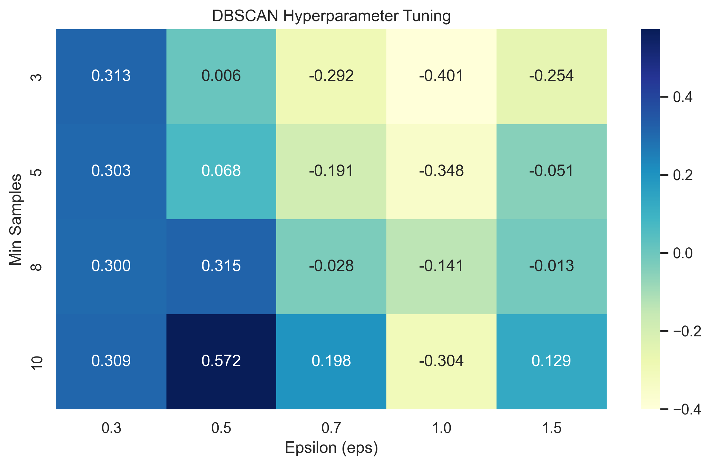

# 📊 Credit Card Customer Segmentation using Unsupervised Learning


---

## 📑 Table of Contents

- [📌 Project Overview](#-project-overview)
- [🎯 Business Objective](#-business-objective)
- [📂 Dataset](#-dataset)
- [👥 Customer Personas](#-customer-personas)
- [🤖 Algorithms Implemented](#-algorithms-implemented)
- [📊 Results & Screenshots](#-results--screenshots)
- [🛠️ Tools & Technologies](#️-tools--technologies)
- [🚀 Installation & Usage](#-installation--usage)
- [📁 Project Structure](#-project-structure)
- [📂 Repository Navigation](#-repository-navigation)
- [🎥 Project Demonstration](#-project-demonstration)
- [👨‍💻 Author](#-author)
- [⭐ Future Improvements](#-future-improvements)

---

# 📌 Project Overview

This project applies **Unsupervised Machine Learning** techniques to segment credit card customers based on their spending behaviour and financial activity.

Three clustering algorithms—**K-Means**, **Agglomerative Hierarchical Clustering**, and **DBSCAN**—were implemented, evaluated, and compared to discover meaningful customer groups without using predefined labels.

The final customer segments provide valuable business insights that can help banks personalize marketing campaigns, improve customer retention, optimize credit card offers, and support better financial decision-making.

---

# 🎯 Business Objective

The objective of this project is to identify distinct groups of credit card customers based on their purchasing patterns, payment behaviour, credit utilization, and cash advance usage.

By understanding these behavioural differences, financial institutions can:

- Personalize marketing campaigns
- Improve customer engagement
- Design targeted reward programs
- Support credit-risk assessment
- Increase customer retention

---

# 📂 Dataset

**Dataset Name**

CC GENERAL Dataset

**Source**

https://www.kaggle.com/datasets/arjunbhasin2013/ccdata

**Dataset Size**

- Approximately **8,950 customers**
- 17 original customer behaviour features

---

# 👥 Customer Personas

| Cluster | Persona | Business Recommendation |
|----------|----------|-------------------------|
| 2 | ⭐ Premium Transactors | Premium rewards, exclusive offers, loyalty programs |
| 0 | 💳 Cash-Advance Reliant | EMI conversion, repayment assistance, financial counselling |
| 1 | 🛍️ Moderate Card Users | Cashback offers, reward points, seasonal promotions |

---

# 🤖 Algorithms Implemented

## 1️⃣ K-Means Clustering

Partitions customers into K distinct groups by minimizing the distance between customers and their cluster centroids.

---

## 2️⃣ Agglomerative Hierarchical Clustering

Builds customer clusters by iteratively merging the closest groups and visualizing relationships using a dendrogram.

---

## 3️⃣ DBSCAN

Groups customers based on density while automatically identifying outliers and noise without requiring the number of clusters beforehand.

---

# 📊 Results & Screenshots

## 📈 Elbow Method



**💡 Insight**

The elbow appears at **K = 3**, indicating that three customer segments provide the best balance between model simplicity and clustering quality.

---

## 🌐 K-Means 3D Visualization



**💡 Insight**

The PCA-based 3D visualization demonstrates a clear separation between the discovered customer groups, making the business segments easier to interpret.

---

## 🔍 DBSCAN Hyperparameter Tuning



**💡 Insight**

The heatmap compares different combinations of **eps** and **min_samples**, helping identify the most suitable parameters for density-based clustering.

---

# 🛠️ Tools & Technologies

- Python
- Jupyter Notebook
- VS Code
- NumPy
- Pandas
- Matplotlib
- Seaborn
- Plotly
- Scikit-Learn
- SciPy
- Joblib

---

# 🚀 Installation & Usage

Clone the repository:

```bash
git clone https://github.com/PareeSojitra0803/CreditCard_Segmentation_Unsupervised_Learning.git
```

Move into the project directory:

```bash
cd Creditcard-Segmentation-Unsupervised-Learning
```

Install required libraries:

```bash
pip install -r requirements.txt
```

Launch Jupyter Notebook:

```bash
jupyter notebook
```

Open:

```
notebooks/CreditCardSegmentation_UnsupervisedLearning.ipynb
```

Run all cells from top to bottom.

---

# 📁 Project Structure

```text
Creditcard-Segmentation-Unsupervised-Learning/
│
├── data/
│   └── CC GENERAL.csv
│
├── models/
│   ├── cc_scaler.pkl
│   └── cc_segmentation_model.pkl
│
├── notebooks/
│   └── CreditCardSegmentation_UnsupervisedLearning.ipynb
│
├── reports/
│   └── summary_report.md
│
├── screenshots/
│   ├── 01_elbow_curve.png
│   ├── 02_kmeans_balance_vs_purchases.png
│   ├── 03_kmeans_3d_clusters.png
│   ├── 04_hierarchical_dendrogram.png
│   ├── 05_dbscan_knn_distance.png
│   └── 06_dbscan_tuning_heatmap.png
│
├── README.md
├── requirements.txt
└── .gitignore
```

---

# 📂 Repository Navigation

| File / Folder | Description |
|---------------|-------------|
| 📓 [Notebook](notebooks/CreditCardSegmentation_UnsupervisedLearning.ipynb) | Complete project implementation |
| 📊 [Dataset](data/CC%20GENERAL.csv) | Credit card customer dataset |
| 🤖 [Models](models/) | Saved scaler and trained clustering model |
| 📝 [Summary Report](reports/summary_report.md) | Project summary and findings |
| 🖼️ [Screenshots](screenshots/) | Project visualizations |
| 📄 [Requirements](requirements.txt) | Required Python libraries |
| 📖 [README](README.md) | Project documentation |

---

# 🎥 Project Demonstration

🎬 **Project Video**

> **Video Link:**  
> YOUR_GOOGLE_DRIVE_OR_YOUTUBE_LINK

---

# 👨‍💻 Author

***Paree G. Sojitra***

> *Passionate about **Data Science**, **Machine Learning**, and building practical AI solutions that transform raw data into meaningful business insights.*

- 💼 GitHub: https://github.com/PareeSojitra0803


---

### ⭐ If you found this project helpful, consider giving it a star!